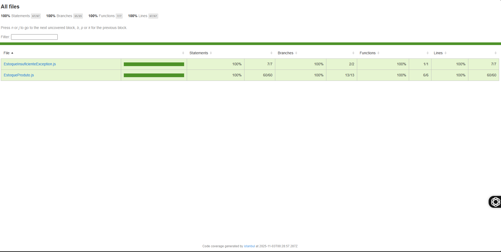

# Atividade: Qualidade e Testes de Software - Tarefa 3

[cite\_start]Este projeto é a resolução da **Tarefa 3: Controle de Estoque de Produtos**[cite: 63], parte da atividade da disciplina de Qualidade e Testes de Software.

[cite\_start]O objetivo principal é demonstrar a aplicação de testes unitários seguindo o padrão AAA (Arrange-Act-Assert) [cite: 26] [cite\_start]para criar uma classe de negócio robusta, garantindo **100% de cobertura de testes** de linhas e ramos (branches)[cite: 94].

## 🎯 Requisitos da Tarefa 3

[cite\_start]A tarefa consistia em criar uma classe `EstoqueProduto` [cite: 68] com os seguintes requisitos funcionais:

  * [cite\_start]Um construtor que recebe `nomeProduto` e `quantidadeInicial`[cite: 69].
  * [cite\_start]O construtor deve lançar `IllegalArgumentException` se a `quantidadeInicial` for negativa[cite: 70].
  * [cite\_start]Um método `adicionar(int quantidade)` que lança `IllegalArgumentException` se a quantidade for menor ou igual a zero[cite: 72].
  * [cite\_start]Um método `remover(int quantidade)` que lança `IllegalArgumentException` se a quantidade for menor ou igual a zero[cite: 74].
  * [cite\_start]O método `remover` deve lançar uma exceção customizada `EstoqueInsuficienteException` se a remoção resultar em estoque negativo[cite: 75].
  * [cite\_start]Um método `getQuantidadeAtual()` para retornar o estoque[cite: 77].

## 🛠️ Tecnologias Utilizadas

  * **Linguagem:** JavaScript (com ES Modules)
  * **Ambiente:** Node.js
  * **Framework de Testes:** [Poku](https://poku.io/) (um test runner moderno e rápido)
  * **Relatório de Cobertura:** [c8](https://github.com/bcoe/c8) (para gerar o relatório de cobertura usando o V8)

## 🚀 Instruções de Instalação e Execução

Siga os passos abaixo para configurar e rodar o projeto localmente.

### 1\. Clonar o Repositório

```bash
# Clone este repositório
git clone https://github.com/SEU-USUARIO/SEU-REPOSITORIO.git

# Acesse a pasta do projeto
cd NOME-DA-PASTA
```

### 2\. Instalar as Dependências

Este projeto usa `poku` e `c8` como dependências de desenvolvimento. Para instalá-las, rode:

```bash
npm install
```

### 3\. Executar os Testes

Para rodar a suíte de testes unitários e verificar se todas as regras de negócio estão sendo atendidas, execute o comando:

```bash
npm test
```

### 4\. Gerar o Relatório de Cobertura (Entregável Principal)

Para executar os testes e gerar o relatório de cobertura de 100%, rode o comando:

```bash
npm run coverage
```

## 📊 Visualizando o Relatório

Após rodar o comando `npm run coverage`, uma nova pasta chamada `coverage/` será criada na raiz do projeto.

Para visualizar o relatório de cobertura detalhado (o entregável solicitado na atividade), **abra o arquivo `coverage/index.html` em seu navegador**.

O relatório deve exibir 100% de cobertura para todos os arquivos de código-fonte, como na imagem abaixo:

